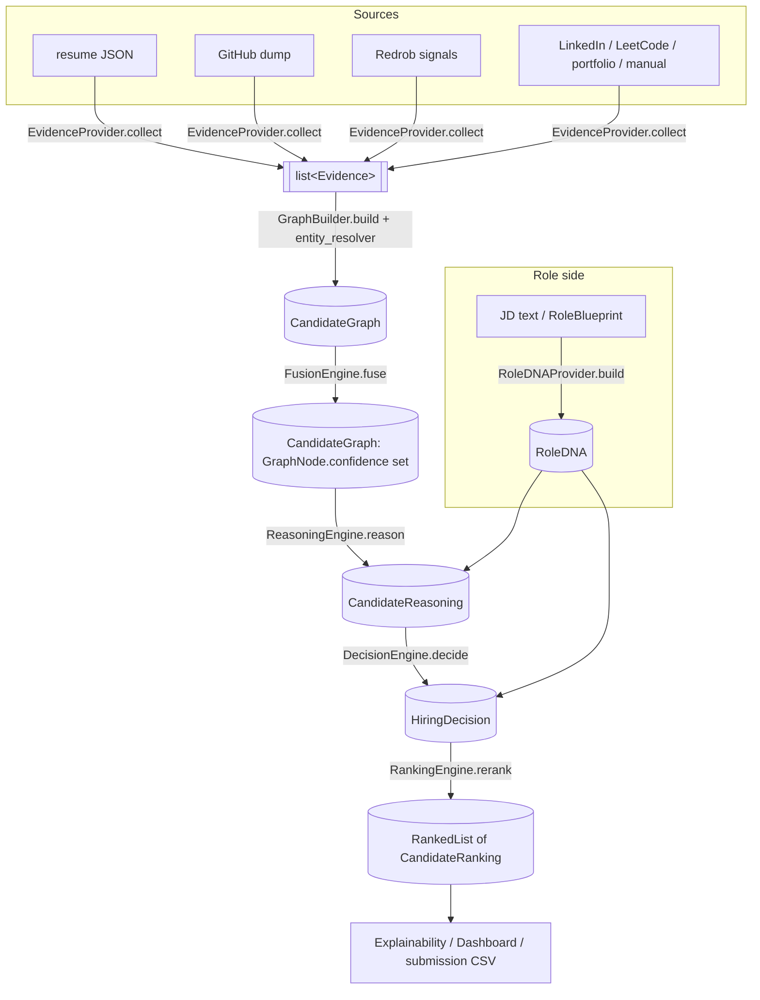
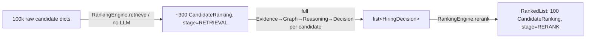

# DELULU v2 — Data Flow

End-to-end flow of the reasoning-first pipeline, the exact `app.shared` model at
each hop, and the `PipelineContext` carrier that threads them together.

---

## 1. End-to-end flow (mermaid)



Two-stage ranking detail (100k → 100):



---

## 2. The shared model at each hop

| # | Stage (interface.method) | Input | Output (`app.shared.models`) |
|---|--------------------------|-------|------------------------------|
| 0 | `RoleDNAProvider.build` | `job_id`, `jd_text?`, `blueprint?` | `RoleDNA` |
| 1 | `EvidenceProvider.collect` | `candidate_id`, raw source `dict` | `list[Evidence]` |
| 2 | `GraphBuilder.build` | `candidate_id`, `list[Evidence]`, `job_id?` | `CandidateGraph` |
| 3 | `FusionEngine.fuse` | `CandidateGraph` | `CandidateGraph` (`GraphNode.confidence` populated) |
| 4 | `ReasoningEngine.reason` | `CandidateGraph`, `RoleDNA` | `CandidateReasoning` |
| 5 | `DecisionEngine.decide` | `CandidateReasoning`, `RoleDNA` | `HiringDecision` |
| 6a | `RankingEngine.retrieve` | `job_id`, `RoleDNA`, candidate dicts, `top_k` | `list[CandidateRanking]` (`RETRIEVAL`) |
| 6b | `RankingEngine.rerank` | `job_id`, `list[HiringDecision]`, `limit` | `RankedList` (`RERANK`) |

Key intra-model relationships preserved across hops:

- `Evidence.evidence_id` → referenced by `GraphNode.evidence_ids` and by
  `EvidenceLedgerEntry` (via `EvidenceLedgerEntry.from_evidence`, bound to a node by
  `supporting_node_id`).
- `Evidence.entity_ref` (canonical id from `entity_resolver`, e.g. `skill:fastapi`)
  is the fusion/dedup key → becomes `GraphNode.id`.
- `ReasoningClaim.supporting_evidence_ids` / `counter_evidence_ids` reference back to
  `Evidence.evidence_id` (Decision A: contradictions land in `counter_evidence_ids`).
- `HiringDecision.derived_score` is the scalar projection that feeds the reranker;
  `CandidateRanking.decision_ref` points back to `HiringDecision.decision_id`.

---

## 3. The `PipelineContext` carrier

`app.shared.context.PipelineContext` is the single mutable state object the
orchestrator constructs **per `(candidate, job)`** and hands to each engine in turn.
Each engine reads what it needs and writes its output back; fields fill in roughly
top-to-bottom as the pipeline advances.

> Note: this is the *candidate-evaluation* carrier — distinct from
> `app.intelligence.pipeline_context.PipelineContext`, which holds document-extraction
> stage state.

```
PipelineContext
├─ request_id / candidate_id / job_id     # scope & identity
├─ raw_sources: dict[str, Any]            # {'github': {...}, 'resume_text': ...}
│
├─ role_dna:  RoleDNA | None              # ← RoleDNAProvider
├─ evidence:  list[Evidence]              # ← EvidenceProvider(s)   (default [])
├─ graph:     CandidateGraph | None       # ← GraphBuilder, then FusionEngine
├─ reasoning: CandidateReasoning | None   # ← ReasoningEngine
├─ decision:  HiringDecision | None       # ← DecisionEngine
├─ ranking:   CandidateRanking | None     # ← RankingEngine
│
├─ stage: str | None                      # current stage (mark_stage)
├─ warnings: list[str]                    # add_warning
├─ telemetry: dict[str, Any]
└─ metadata:  dict[str, Any]
```

Carrier lifecycle through the pipeline:

```
mark_stage("role_dna")   ctx.role_dna  = await role_provider.build(job_id, jd_text)
mark_stage("evidence")   ctx.evidence += await provider.collect(cid, raw)
mark_stage("graph")      ctx.graph     = await builder.build(cid, ctx.evidence, job_id)
mark_stage("fusion")     ctx.graph     = await fusion.fuse(ctx.graph)
mark_stage("reasoning")  ctx.reasoning = await reasoner.reason(ctx.graph, ctx.role_dna)
mark_stage("decision")   ctx.decision  = await decider.decide(ctx.reasoning, ctx.role_dna)
mark_stage("ranking")    ctx.ranking   = <row from rerank for this candidate>
```

`mark_stage(name)` records the executing stage; `add_warning(message)` accumulates
non-fatal issues without breaking the flow.
